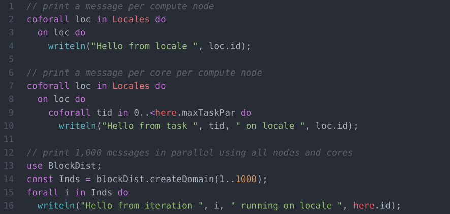

# pulsar-ide-chapel

Provides Chapel support for [Pulsar](https://pulsar-edit.dev/).

Designed as a replacement for the Atom package `fsouza/language-chapel`, which is no longer available.

All contributions and feedback are welcome.
